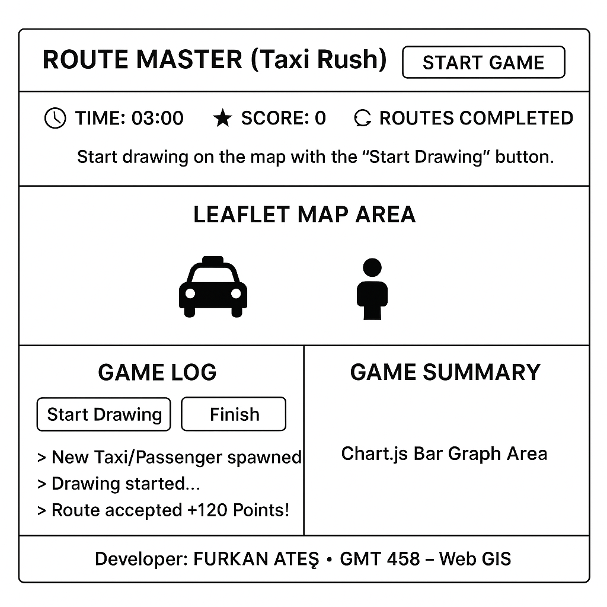

# geogame-furkan9000

GeoGame Design (Route Master)

This document details the design phase and requirements for the "Route Master" (Taxi Rush) GeoGame project, developed as part of the "GMT 458 – Web GIS" course.

Game Idea: Within a 3-minute time limit, the player will manually draw routes on a real city map between randomly appearing "Taxi" and "Passenger" points, following the road network with their mouse. Points are awarded for each successful and efficient route, and the goal is to achieve the highest score before time runs out.

1. Requirements

Geospatial Component: The game will use real-world road network data provided by OpenStreetMap (OSM).

Interaction: The player will actively interact with the map (freehand drawing / creating a Polyline), not just passively view it.

Validation: The validity (proximity to start/end points) and efficiency (deviation from the shortest route) of the player's drawn route will be validated on the server and client side.

Temporal Component: The game will be in a "Time-Attack" format. There will be a 3-minute (180 seconds) countdown timer.

Scoring: Points will be awarded for each successfully completed route. Efficiency (proximity to the shortest route) and speed (drawing quickly) will earn bonus points.

Technical Requirements:

Map Visualization: Leaflet.js + OpenStreetMap

Geospatial Calculations: Turf.js

Route Optimization: OSRM API

Data Visualization: Chart.js (for performance graphs)

Responsive Design: Ability to run on all devices.

2. Frontend Layout

The game's interface is designed to be simple and clear, prioritizing the user experience (UX).

Interface Wireframe

The following wireframe illustrates the layout of the main game screen (game.html or index.html).

Interface Components

Header: The game's title and main control buttons (Start/Restart).

Topbar: Critical game information showing the remaining time, current score, and number of completed routes.

Map: The main component of the game. Icons appear, and the player draws in this area, which is rendered with Leaflet.

Bottom Panel:

Game Log: Provides feedback to the player (e.g., "Route accepted," "Drawing started"). Drawing controls (Draw/Finish) are located here.

Game Summary (Chart): Contains a summary graph created with Chart.js after the game ends, showing the player's per-minute performance.

3. Design Question Answers

How will the game progress (any difficulty level, time-based progression, etc.)?

The game will progress based on a time-based progression (Time-Attack) model.

Duration: The player will have a total of 3 minutes (180 seconds).

Progression: Within these 3 minutes, the player will try to manually draw as many routes as possible between the randomly appearing Taxi-Passenger pairs on the map.

Difficulty: There are no predefined difficulty levels like "Easy," "Medium," or "Hard." The difficulty arises from the distance between the randomly spawning points and the race against time. A failed drawing (invalid route) indirectly makes the game harder by causing time loss.

Goal: The objective is to collect the highest score possible until the 3 minutes run out.

How many lives, if any, will the user have?

There will not be a "lives" system in the game.

The core mechanic of the game is a race against time. If the player draws an invalid route or chooses an inefficient path, their penalty will not be "losing a life" but "losing time" A failed attempt does not award points and causes the player to waste valuable seconds on that pair of points. This maintains the game's flow and is more suitable for the "Time-Attack" format. 
